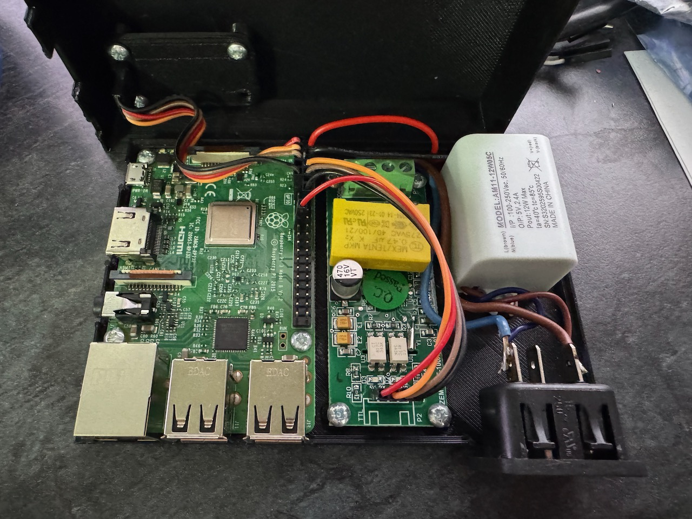
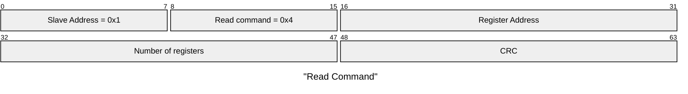
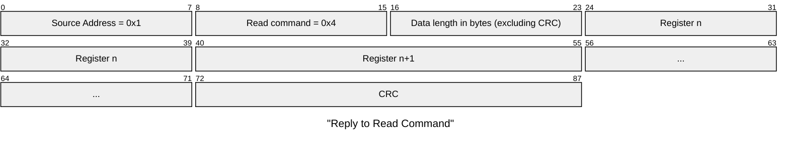

This project uses the PZEM-004T to monitor mains power usage using a Raspberry PI. Voltage, current and power usage are displayed on an SSD1306 I2C display. The code is written in OCaml.



The PZEM-004T uses a 3.3V regulator on the mains side to power the V98810 chip and the optoisolators; however, the microcontroller interface expects 5V logic levels. The Raspberry PI GPIO pins are 3.3V.

Looking at the [circuit diagram](https://community-assets.home-assistant.io/original/3X/2/e/2e1b5470742cff53fbb7271e573cc04f43947728.png) for the PZEM-004T, the isolator uses a 210 ohm resistor (R3) on the 3.3V side, but on the TTL side, R8 is 1K. I have replaced this with a 220ohm resistor so it can interface with the Raspberry Pi 3.3V.

The PZEM-004T uses a ModBUS serial interface, which can be connected to the Raspberry Pi serial port. This is available on pins 8 and 10 of the header.

To enable the serial port, open `raspi-config`, choose Interfacing options, then Serial. Answer No to the part asking if you want to activate a shell via the serial connection, then Yes to the part asking if you're going to activate the hardware port. Finally, say Yes to the question asking if you want to reboot the Raspberry Pi.

Using a Raspberry Pi 3b, I needed to disable Bluetooth as this also uses this serial port. Add this line to the end of `/boot/firmware/config.txt`

```
dtoverlay=disable-bt
```

The Raspberry Pi pin-out is shown below.
```
                 +--+--+                   
       3V3 power | 1| 2| 5V power          
                 +--+--+                   
    GPIO 2 (SDA) | 3| 4| 5V power          
                 +--+--+                   
    GPIO 3 (SCL) | 5| 6| Ground            
                 +--+--+                   
 GPIO 4 (GPCLKO) | 7| 8| GPIO 14 (TXD)     
                 +--+--+                   
          Ground | 9|10| GPIO 15 (RXD)     
                 +--+--+                   
         GPIO 17 |11|12| GPIO 18 (PCM CLI) 
                 +--+--+                   
         GPIO 27 |13|14| Ground            
                 +--+--+                   
         GPIO 22 |15|16| GPIO 23           
                 +--+--+                   
       3V3 power |17|18| GPIO 24           
                 +--+--+                   
  GPIO 10 (MOSI) |19|20| Ground            
                 +--+--+                   
   GPIO 9 (MISO) |21|22| GPIO 25           
                 +--+--+                   
  GPIO 11 (SCLK) |23|24| GPIO 8 (CEO)      
                 +--+--+                   
          Ground |25|26| GPIO 7 (CE1)      
                 +--+--+                   
  GPIO 0 (ID_SD) |27|28| GPIO 1 (ID_SC)    
                 +--+--+                   
          GPIO 5 |29|30| Ground            
                 +--+--+                   
          GPIO 6 |31|32| GPIO 12 (PWMO)    
                 +--+--+                   
  GPIO 13 (PWM1) |33|34| Ground            
                 +--+--+                   
GPIO 19 (PCM_FS) |35|36| GPIO 16           
                 +--+--+                   
         GPIO 26 |37|38| GPIO 20 (PCM_DIN) 
                 +--+--+                   
          Ground |39|40| GPIO 21 (PCM_DOUT)
                 +--+--+                                
```

These are the registers available from the PZEM-004T.

| Register address | Description                | Resolution                           |
| ---------------- | -------------------------- | ------------------------------------ |
| 0x0000           | Voltage value              | 1 LSB corresponds to 0.1V            |
| 0x0001           | Current value low 16 bits  | 1 LSB corresponds to 0.001A          |
| 0x0002           | Current value high 16 bits |                                      |
| 0x0003           | Power value low 16 bits    | 1 LSB corresponds to 0.1W            |
| 0x0004           | Power value high 16 bits   |                                      |
| 0x0005           | Energy value low 16 bits   | 1 LSB corresponds to 1Wh             |
| 0x0006           | Energy value high 16 bits  |                                      |
| 0x0007           | Frequency value            | 1 LSB corresponds to 0.1Hz           |
| 0x0008           | Power factor value         | 1 LSB corresponds to 0.01            |
| 0x0009           | Alarm status               | 0xFFFF is alarm, 0x0000 is not alarm |

One or more registers can be read by sending a read packet via the serial port to the PZEM-004T.



A successful reply packet has the following format.



All 16 bit words are big endian.

For example, the master sends the following command (CRC check code is replaced by 0xHH and 0xLL, the same as below)

```
0x01 0x04 0x00 0x00 0x00 0x0A 0xHH 0xLL
```

This indicates that the master needs to read all 10 registers with the slave address 0x01 and the start address of the register 0x0000. This should yield a reply packet like this: (line breaks added for clarity)

```
0x01 0x04 0x14
0x08 0x98 0x03 0xE8 0x00 0x00 0x08 0x98 0x00 0x00
0x00 0x00 0x00 0x00 0x01 0xF4 0x00 0x64 0x00 0x00 0xHH 0xLL
```

The above packet shows
- Message from station 0x01
- Reply to a read command 0x04
- Length is 0x14, converted to decimal is 20 bytes (10 x 16 bit registers)
- Voltage is 0x0898, converted to decimal is 2200, display 220.0V
- Current is 0x000003E8, converted to decimal is 1000, display 1.000A
- Power is 000000898, converted to decimal is 2200, display 220.0W
- Energy is 0x00000000, converted to decimal is 0, display 0Wh
- Frequency is 0x01F4, converted to decimal is 500, display 50.0Hz
- Power factor is 0x0064, converted to decimal is 100, display 1.00
- Alarm status is 0x0000, indicates that the current power is lower than the alarm power threshold

In OCaml, the serial port can be used via `/dev/serial0` using the [Unix](https://ocaml.org/manual/5.2/api/Unix.html).

The SSD1306 can be connected to the I2C bus on the Raspberry Pi (pins 3 and 5).  `i2cdettect` should report the display at address `0x3c`.

```
$ i2cdetect -y 1
     0  1  2  3  4  5  6  7  8  9  a  b  c  d  e  f
00:                         -- -- -- -- -- -- -- -- 
10: -- -- -- -- -- -- -- -- -- -- -- -- -- -- -- -- 
20: -- -- -- -- -- -- -- -- -- -- -- -- -- -- -- -- 
30: -- -- -- -- -- -- -- -- -- -- -- -- 3c -- -- -- 
40: -- -- -- -- -- -- -- -- -- -- -- -- -- -- -- -- 
50: -- -- -- -- -- -- -- -- -- -- -- -- -- -- -- -- 
60: -- -- -- -- -- -- -- -- -- -- -- -- -- -- -- -- 
70: -- -- -- -- -- -- -- --                         
```

From OCaml, there is an i2c [library](https://github.com/mwweissmann/ocaml-i2c) available via opam, which performs the appropriate `ioctl` commands to use the i2c bus.

References

[SSD1306](https://cdn-shop.adafruit.com/datasheets/SSD1306.pdf)
[Rasbperry PI mechanical](https://datasheets.raspberrypi.com/rpi3/raspberry-pi-3-b-mechanical-drawing.pdf)

GNU plot

```sh
gnuplot -p -e 'set datafile separator ","; set terminal png size 4000,1080; set output "power.png" ; set xdata time; set timefmt "%Y-%m-%d,%H:%M:%S"; set xrange ["2025-01-01":"2025-01-02"]; set format x "%d/%m\n%H:%M"; set y2range [200:260]; set ytics 5 nomirror tc lt 1; set y2tics 5 nomirror tc lt 2; plot "now.csv" using 1:4 with lines title "Amps", "now.csv" using 1:3 with lines title "Voltage" axes x1y2'
```
